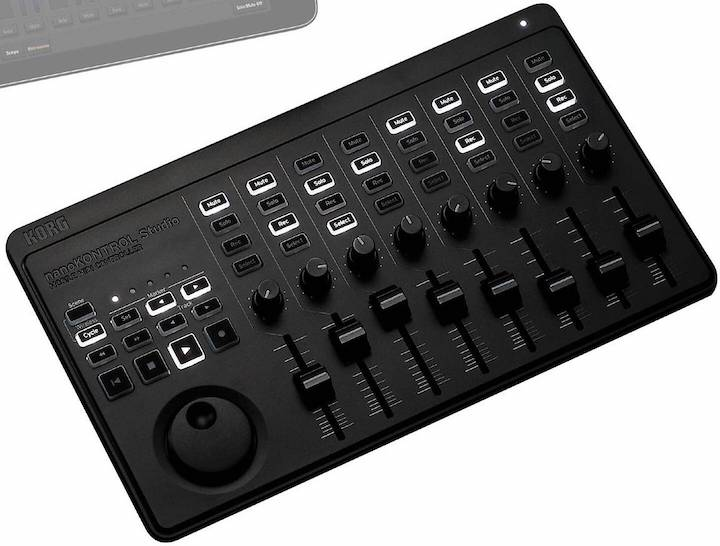
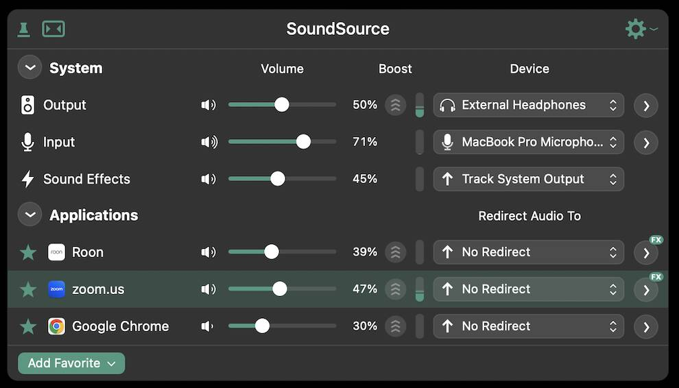
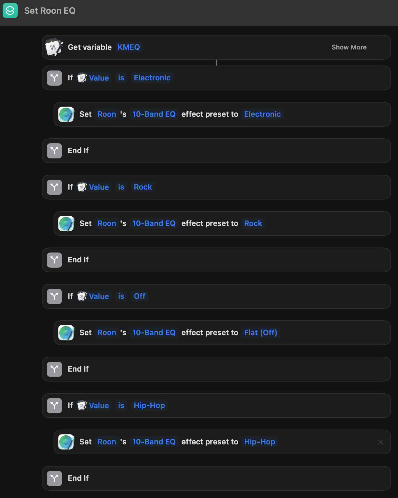

_Using a hardware MIDI mixer to control software audio volumes with SoundStage and Keyboard Maestro on macOS._

## Equipment/Software Used

* MIDI Controller/Mixer

* Software Audio Mixer

* Apple Shortcuts (included with macOS)
  * SoundSource's Apple Shortcuts Integration
  * Provides the binder between Keyboard Maestro and SoundSource.

---

## Implementation Details

**Keyboard Maestro MIDI Integration**

Keyboard Maestro allows for the creation of sequences of actions to be performed via a variety of input methods.  Usually this accomplished by various keystrokes or combinations of them, but one of the available methods of triggering them is via MIDI!  I leveraged this to accomplish the task of converting MIDI signals from my controller to manipulate the input data and pass it along the path to eventually control the SoundSource mixer.

## Simple Button Actions

The best place to start is with simple MIDI button actions.  I leverage this to quickly set the EQ for different songs on the fly or trigger other non-music actions that I've programed in.  Once you've setup the first, it's easy to quickly add more as you see fit.  This example will be targeted at changing the EQ for a single application or system wide (however you want to do it)

### Keyboard Maestro Steps

* Start by creating a new macro in KM.  Name it something like 'MIDI controller EQ off' (or whatever EQ action this button will perform) and click the 'New Trigger' button and choose 'MIDI Trigger'
* With the 'MIDI Learn' checkbox checked, click a single button on your MIDI controller/device
* The 'note' text input should have changed to the MIDI number of that input
  * Once that's complete, uncheck 'MIDI Learn' so you don't override the device number
  * Also, change the drop down to the right of the 'note' text field from 'is pressed' to 'is released' (this helps prevent double inputs and gives a more "natural" experience)
* Click the `New Action` button at the lower end of the pane on the right
  * In the search bar of the newly opened middle pane, search for "Set Variable to Text", then drag the time to the bottom section of the pane on the right under the "Will execute the following actions:" header.
* In the new section that appeared enter the following values (note: you will need to do this for each EQ preset that you want to have a hot button for):
  * 'Set variable' - `KMEQ` (You will be using this same variable for each EQ macro and the Apple Shortcuts so make sure you note it down and keep it consistent)
  * 'to' - `Off`
* Once that is done, save your macro and head over to the Apple Shortcuts app that is included with macOS, but don't close out Keyboard Maestro

### Apple Shortcut Steps

Once you've loaded the Apple Shortcuts app do the following:

* Click the `+` button in the toolbar to create a new shortcut
* In the search dialog in the top of the right side pane, search for 'keyboard maestro', in the filtered list double click: 'Get Variable'
* In the new item at the top of the center pane, click where the pill icon says 'Variable', and change it to `KMEQ`
* Next clear the search dialog and search for `if`, double click on it when it shows up in the filtered list
  * Delete the 'Otherwise' pill in the middle of the `if` block by clicking on the `x` on the right side of the pill.
  * In the `if` block, click the 'Condition' text, then choose 'is', then click the 'Text' section and enter `Off`  
    * This last value is the name of the EQ preset that you are trying to activate.  In this example it is `Off`, but if you are continuing on, it would be whichever you are currently trying to configure.  This **MUST** match one of the variable assignments you made in the previous Keyboard Maestro steps, otherwise it will not trigger a valid EQ preset!
* Next clear the search dialog again and now enter `soundsource`
* Drag the list item `Set Source Effect Preset` in between the 'If' and 'End If' pill boxes
  * Add the following information
    * 'Source' - Choose the name of the application to apply the effect to from the dropdown (Roon in my example).  If you don't see your device listed, delete the item you just added between the `if` block, open the target application and play some sound through it and try again.  The application should now show up in the 'Source' dropdown list.  If not, you can enter the name manually making sure that the name matches exactly how it's shown in SoundSource.  This **IS** case sensitive!
    * 'Effect' - Choose from the drop down one of the effects that you have enabled through sound source for that application (10-Band EQ in my example)
    * 'Preset' - Choose from the list of presets that are provided.  `Flat (Off)` in my example.
* Save your work to something descriptive! `Set Roon EQ` in my case. Then switch back to Keyboard Maestro.  (Note you _can_ finish configuring Shortcuts fully before heading back to Keyboard Maestro, but for the sake of brevity we won't)

### Back in Keyboard Maestro

Make sure that you are still in the Macro that you were before and do the following:

* Click 'New Action' at the bottom of the pane on the right
* Search for 'Execute Shortcut' and drag the result below your 'Set Variable' block configured previously.
  * Click the small downward arrow to the right of the 'Execute shortcut' dialog and select the name of the shortcut you just created.  (note: if it does not show up right away, try closing Keyboard Maestro and/or Shortcuts and reopening them.)

---

## Final Product

That's it!  You should now be able to trigger that EQ setting to whichever application you configured.  You can keep adding more by repeating the same steps above with the following things in mind:

* You **MUST** use the same Keyboard Maestro variable `KMEQ` in my example for all the Keyboard Maestro triggers.  Since that is what is sent to that single shortcut, the value should be unique though.
* When expanding the Shortcut, simply add a new `if` block, deleting the otherwise block as before, and match it with the value from the Keyboard Maestro variable value.



---

## Next Steps

The second part to this article, which covers using sliders and knobs to control independent application volume levels, can be found [here]().

## Links

* [SoundSource](https://rogueamoeba.com/soundsource/)
* [Keyboard Maestro](https://www.keyboardmaestro.com/main/)
* [KORG nanoKONTROL Studio](https://www.guitarcenter.com/KORG/nanoKONTROL-Studio.gc?rNtt=korg%20kontrol&index=2)
* [GitHub repo of Keyboard Maestro Macros and Apple Shortcuts](https://github.com/cslamar/random-experiments/tree/main/midi-controller-keyboard-maestro)
